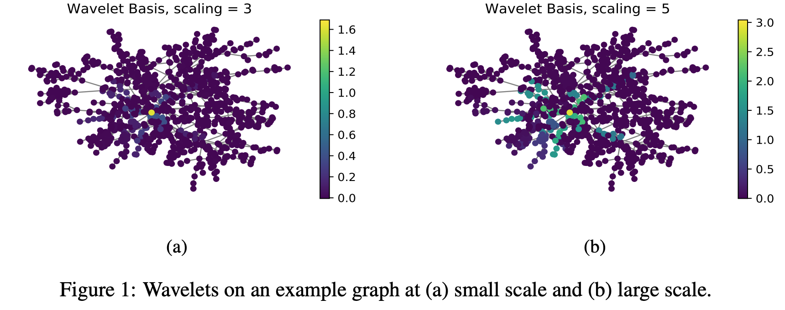
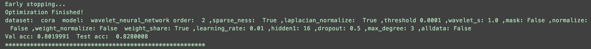

## Graph Wavelet Neural Network
> Graph Wavelet Neural Network. Bingbing Xu, Huawei Shen, Qi Cao, Yunqi Qiu, Xueqi Cheng. ICLR, 2019. [pdf](https://openreview.net/pdf?id=H1ewdiR5tQ)

## Overview

 

> We provide a TensorFlow implementation of Graph Wavelet Neural Network, which implement graph convolution via graph wavelet transform instead of Fourier transform. Different from graph Fourier transform, graph wavelets are sparse and localized in vertex domain, offering high efficiency and good interpretability for graph convolution. We evaluate our model in the task of graph-based semi-supervised classification.

## Requirements
the script has been tested running under Python 2.7, with the following packages installed (along with their dependencies):
* tensorflow==0.12.0
* numpy==1.14.0
* scipy==0.19.1
* networkx==2.0

## Run the code
* cd GraphWaveletNetwork
* python train.py

## Parameters
* --wavelet_s                 FLOAT         wavelet scaling parameter                  Cora: 1.0, Citeseer: 0.7, Pubmed: 0.5
* --threshold                 FLOAT         threshold parameter for wavelet            Cora: 1e-4, Citeseer: 1e-5, Pubmed: 1e-7
* --epochs                    INT           Number of Adam epochs.                     Default is 1000.
* --early-stopping            INT           Number of early stopping epochs.           Default is 100.

## Run Example
The run example for Cora dataset in default parameter

 

## Cite
Please cite our paper if you use this code in your own work:

> @inproceedings{
xu2018graph,
title={Graph Wavelet Neural Network},
author={Bingbing Xu and Huawei Shen and Qi Cao and Yunqi Qiu and Xueqi Cheng},
booktitle={International Conference on Learning Representations},
year={2019},
url={https://openreview.net/forum?id=H1ewdiR5tQ},
}

## Acknowledgement

> Some sections of code adapted from tkipf/gcn(https://github.com/tkipf/gcn)
